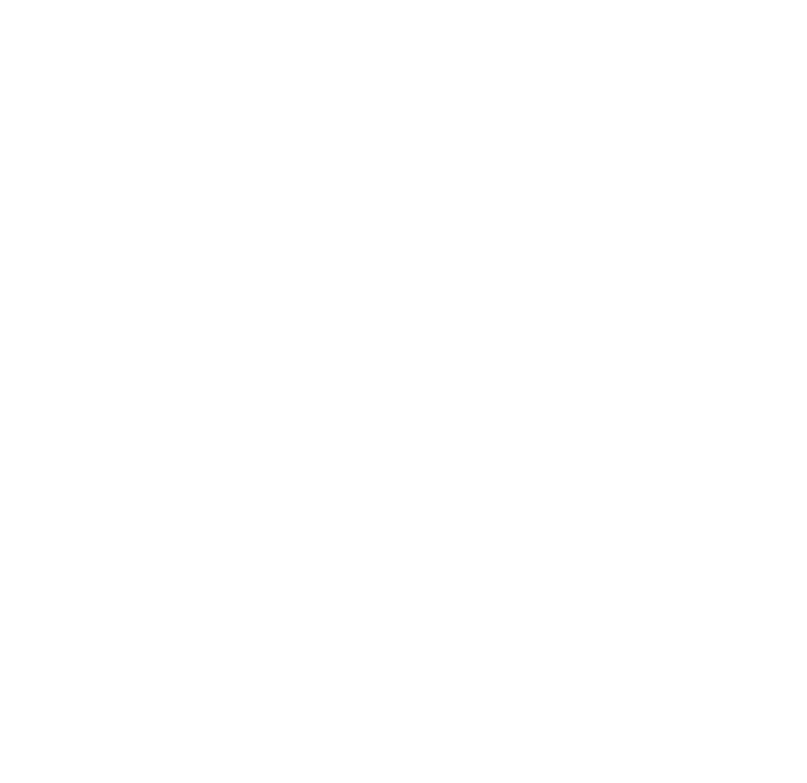

<p align="center">
  
</p>


# Backend Model NLP API SerabutInn
> Capstone Project C242-PR580

### Development Backend Model NLP Endpoint
- **SerabutInn Model NLP**: **https://serabutinn-model-nlp-1079606741730.asia-southeast2.run.app**

# API Documentation

### Model NLP

- **URL**: `/predict/nlp`
- **Method**: `POST`
- **Request Body**:
  - `title` as `string` - `Title`
- **Response (Illegal)**:

```json
{
    "status": 200,
    "message": "Model predicted successfully",
    "data": "Illegal",
    "error": false
}
```
- **Response (Legal)**:

```json
{
    "status": 200,
    "message": "Model predicted successfully",
    "data": "Legal",
    "error": false
}
```
## Contributors

### Cloud Computing Member
Cloud Computing member is responsible for the development of the API service and deployment of the model. In sort, in this project Cloud Computing is responsible for Backend, Infrastructure, and DevOps.

- Louis Michael
- Muhammad Baharuddin Yusuf
- Mulia Rahmah
#### Individuals

<div style="display: grid; grid-template-columns: auto auto; gap: 10px;">
 
  
   
</div>